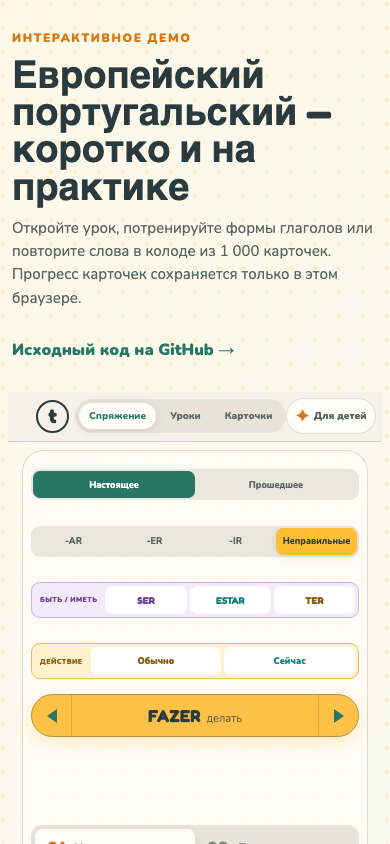

# Tempo

Tempo — лёгкий pet project для изучения европейского португальского в мобильном браузере. В приложении есть короткие уроки, свободная практика спряжений и карточки для повторения слов/глаголов.

Интерфейс сделан на русском языке, учебный материал — на португальском. Основной фокус проекта — аккуратная frontend-архитектура, понятное состояние экранов, доступные UI-компоненты и проверяемые пользовательские сценарии.

**[Открыть интерактивное демо](https://kroha22.github.io/tempo-react/)**

GitHub Pages показывает автономную клиентскую витрину: уроки, тренажёр и колоду из 1 000 глаголов. Прогресс карточек сохраняется только в текущем браузере. Полная версия проекта использует Route Handlers и Cloudflare D1 для пользовательского прогресса; серверная часть намеренно не имитируется на статическом хостинге.



## Что есть в проекте

- **Learning route** — последовательный маршрут уроков с checkpoint и сохранением прогресса.
- **Practice** — тренажёр спряжений с режимами изучения, практики, выбора формы и обратного задания.
- **Kids mode** — единое игровое оформление тех же упражнений и той же языковой логики.
- **Cards** — карточки с интервальным повторением и очередью на основе прогресса.
- **Saved study items** — сохранение слов и выражений из уроков в общий карточный поток.
- **Typed content** — учебный контент описан типами и проходит валидацию перед сборкой.

## Стек

| Область | Технологии |
|---|---|
| UI | React 19, React Server Components, React Aria Components |
| Framework/runtime | Next.js App Router через vinext + Vite |
| Язык | TypeScript strict |
| Server boundary | Route Handlers / Backend-for-Frontend |
| Data | Cloudflare D1, Drizzle ORM |
| Async state | TanStack Query |
| Validation | Zod |
| Styling | CSS Modules + global design tokens |
| Tests | Node test runner, Vitest, Testing Library, server handler tests |
| Tooling | ESLint 9, GitHub Actions, Wrangler |

Проект намеренно небольшой: без отдельного backend-сервиса, микросервисов и глобального state manager. Интерактивные сценарии держат локальное состояние рядом с экраном, серверные данные проходят через API-адаптеры и проверяются на границе.

## Архитектура

```text
app/                    страницы, layout и Route Handlers
features/
  app-shell/            shell, навигация, layout-level UI
  learning/             уроки, маршрут, прогресс, lesson flow
  practice/             свободная практика и детское оформление
  cards/                карточки, review session, scheduler, API adapter
  conjugation/          данные и чистые функции спряжений
  content/              типизированный учебный контент
  scenes/               модель интерактивных сцен
shared/
  http/                 безопасный HTTP transport
  query/                общий TanStack Query boundary
  ui/                   базовые UI primitives и tokens
db/                     Drizzle schema и D1 connection
tests/                  domain, component и server tests
```

Ключевые правила архитектуры:

- `app` собирает features и владеет роутингом.
- `features` не импортируют страницы и серверные bindings напрямую.
- `shared` не знает о предметной области.
- UI-компоненты не содержат API-запросов и правил расписания повторения.
- Durable progress хранится через API/D1, а не в browser-only storage.
- Проверка внешних данных выполняется через Zod/DTO перед использованием в React.

## Интересные места в коде

- [PracticeScreen](./features/practice/PracticeScreen.tsx) — coordinator тренажёра спряжений: хранит состояние и собирает feature-компоненты.
- [SunFormExercise](./features/practice/SunFormExercise.tsx) — солнечная схема форм и drag/click-friendly practice flow.
- [RulesDeck](./features/practice/RulesDeck.tsx) — детская шпаргалка по группам глаголов.
- [QuizExercise](./features/practice/QuizExercise.tsx) — режимы выбора формы и обратного задания с CSS Module.
- [BeingGuide](./features/practice/BeingGuide.tsx) — цельный SER/ESTAR flow: правило, солнечная схема и тренировка на одном экране.
- [ActionGuide](./features/practice/ActionGuide.tsx) — цельный flow для `presente` vs `estar a + infinitivo`: правило, смысловая схема, солнечная форма и мини-практика.
- [TerGuide](./features/practice/TerGuide.tsx) — третий irregular-pattern lesson для `ter`: обладание, возраст, частые состояния и форма `têm` через общую солнечную тренировку.
- [Flashcards](./features/cards/components/Flashcards.tsx) — карточки и состояния повторения.
- [useReviewSession](./features/cards/hooks/use-review-session.ts) — загрузка, retry и сохранение карточек.
- [review-session](./features/cards/review-session.ts) — reducer без React.
- [scheduler](./features/cards/scheduler.ts) — pure scheduling logic для spaced repetition.
- [progress adapter](./features/cards/api/progress.ts) — проверка server response перед попаданием в UI.

## Запуск локально

Требуется Node.js `22.23.2` или совместимая версия ветки 22. Версия закреплена в [.nvmrc](./.nvmrc).

```bash
nvm use
npm ci
npm run dev
```

Production-like preview после сборки:

```bash
npm run build
npm start -- --port 3101
```

После старта откройте адрес из вывода сервера, например:

```text
http://127.0.0.1:3101/learning
```

## Проверки

| Команда | Что проверяет |
|---|---|
| `npm run lint` | ESLint, React Hooks и import boundaries |
| `npm run typecheck` | TypeScript без emit |
| `npm test` | domain logic, contracts, scheduler, content validation cases |
| `npm run test:components` | React-компоненты, keyboard/click flows, retry и UI states |
| `npm run test:server` | Route handlers, auth boundary и безопасные ошибки |
| `npm run test:visual` | Playwright visual baselines и mobile overflow каталога UI |
| `npm run build` | content validation и production build |
| `npm run check` | полный локальный quality gate |
| `npm run test:smoke` | основные HTML routes и anonymous API behavior на запущенном сервере |

Последний полный прогон:

```text
npm run check
# domain tests: 46 passed
# component tests: 64 passed
# server tests: 16 passed
# build: passed
```

## UI и дизайн

Tempo использует тёплую визуальную систему: зелёный/жёлтый base palette, Fredoka для выразительных заголовков и Nunito для интерфейсного текста. Детский режим добавляет более игровое оформление и солнечные формы, но использует те же учебные данные и правила проверки, что и взрослый режим.

В проекте уже есть первые общие primitives:

- `Button`
- `Feedback`
- `ChoiceGroup` на React Aria RadioGroup
- дизайн-токены в `shared/ui/tokens.css`
- CSS Modules для изолированных feature-level компонентов

Живой каталог реальных состояний доступен после локального запуска: [Tempo UI Lab](http://127.0.0.1:3101/ui). Отдельные состояния имеют стабильные URL вида `/ui?state=kids-map` и используются Playwright-снимками.

## Что дальше

Ближайший план развития:

1. **Расширить shared UI**
   Добавить `SegmentedControl`, `Surface/Card`, `PageHeader` и единый `IconButton`. React Aria использовать только там, где нужен сложный accessibility behavior, а не ради каждой кнопки.

2. **Добавить ещё один meaning-specific lesson**
   После SER/ESTAR, Action и TER хороший следующий кандидат — `HÁ` как безличное “есть в комнате”, с явным контрастом к TER possession. `dar` оставить как отдельный irregular drill, когда появится понятная мини-ситуация.

3. **Добавить browser regression tests**
   Зафиксировать сценарии: взрослый practice, kids mode, переход из lesson summary к солнцам, card save retry. Сейчас это проверяется вручную и частично компонентными тестами.

4. **Усилить demo-readiness**
   Подготовить аккуратные seed/demo states, пустые состояния, loading/error screens и короткий список demo routes для README.

5. **Почистить production story**
   Описать безопасную авторизацию перед публичным деплоем: текущий header-based adapter подходит только за доверенным gateway.

6. **Design polish**
   Свести цвета и spacing в токены, проверить контраст, длинные русские строки, focus states и 390×844 viewport.

## Данные и лицензии

Частотная колода глаголов собрана из открытых источников. Атрибуция для переводов сохранена рядом с исходником данных в [verb-cards.ts](./features/cards/data/verb-cards.ts).
